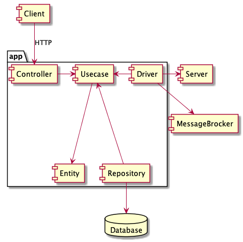

# Micro Gateway

A simple solution to simple problems.

# Folder Structure

The folder structure follwos Clean Architecture ideas

It is:

    app
     |-> entity
     |-> usecase
     |-> adapter
         |-> repository
         |-> driver
         |-> controller

The *app* folder contains the main program. It sole pourpose is to join all the application componentes. It inject dependencies in all componentes and starts the app.

The *entity* Contains the general domain entities.

The *usecase* Contains this app specific business logic and specific entities.

The *adapter* contains the interface adapters.

The *repository* package contains the *interface adapters* that connects to different system to persiste information. Those could be database system, in memory cache, etc.

The *driver* package contains componentes to connect to external system in which this app acts as client. Typical are HTTP clients, messaging systems, etc.

The *controller* package contains componentes to connect the external systems to this app. This app will act as a server

# References

* 